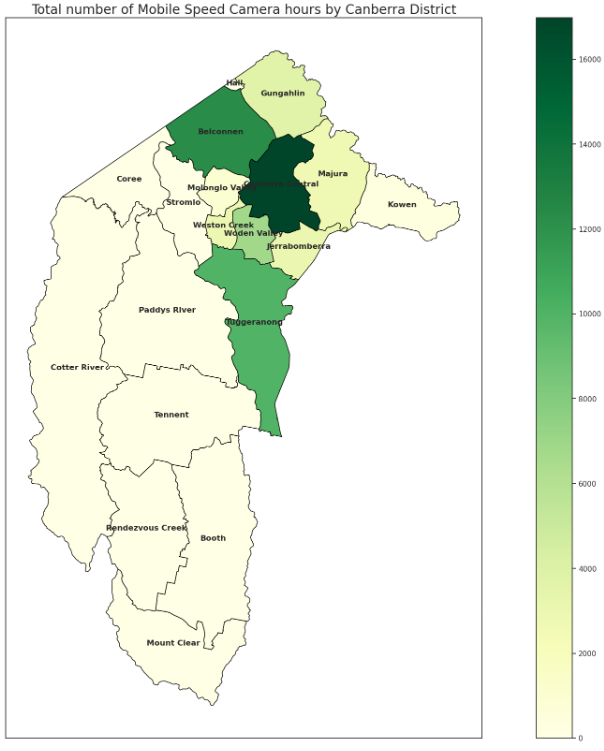

# Portfolio
### Optimising marketing comms using uplift modelling

Advertisements and communications have varying levels of effectiveness on customers. I explore the use of uplift modelling to measure this level by each individual customer, optimising spend through selective targetting.

[Link to code on github](/another-page.html](https://github.com/vernlam/portfolio/blob/uplift/Uplift/Uplift.ipynb))

### Descriptive analysis on speed camera usage in Canberra

In this project, I use Geopandas, pandas and Numpy to explore speed camera usage in the Australian Capital Territory.

[Link to code on github](/another-page.html](https://github.com/vernlam/portfolio/blob/speedcamera/SpeedCamera/project.ipynb))
